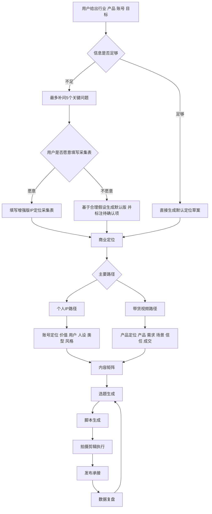
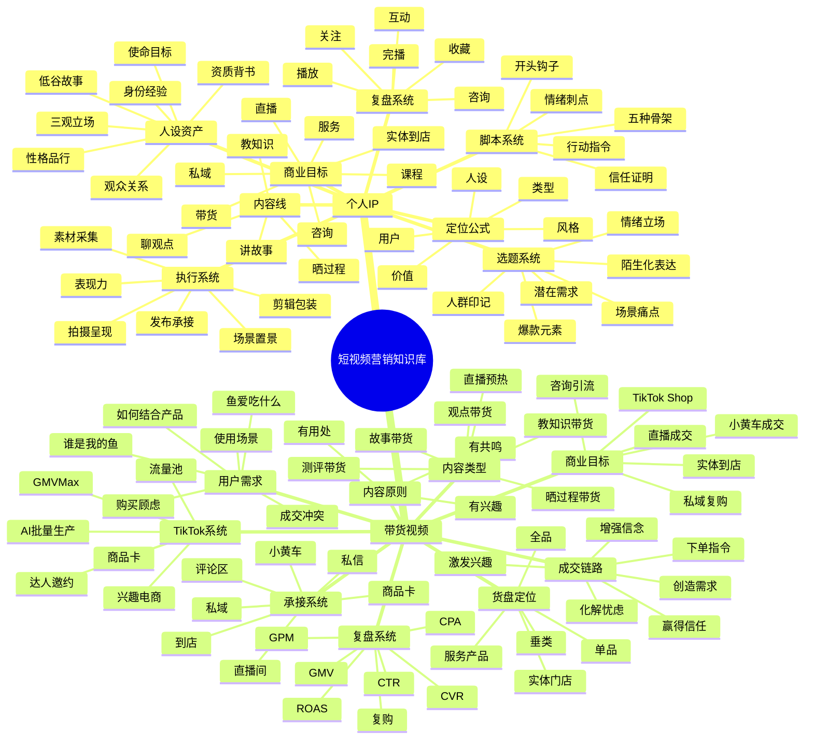
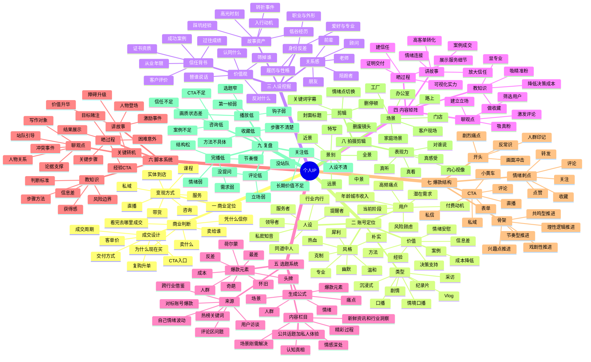
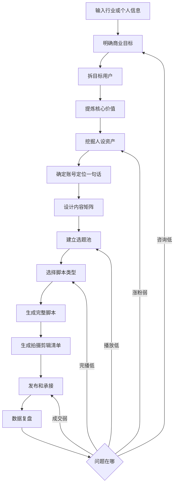
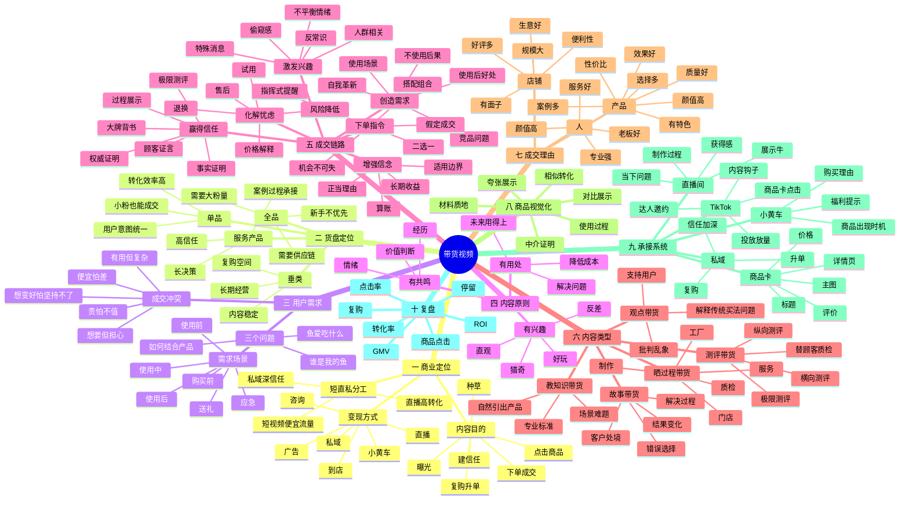
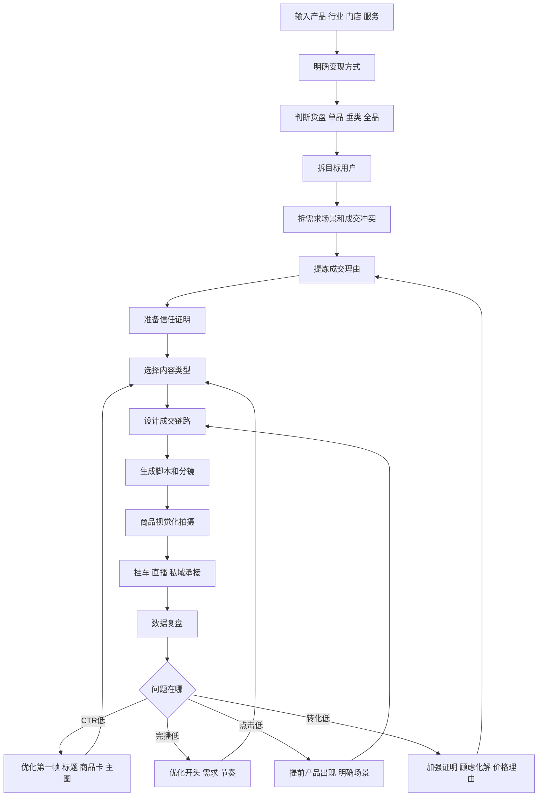
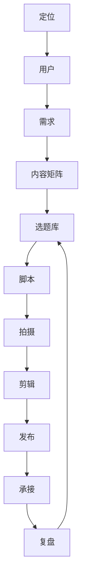
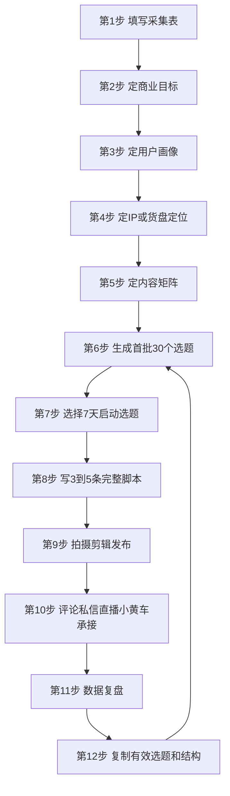

# 个人IP与带货视频全知识库详细脑图和流程

## 使用定位

本文件是整个知识库的总调用入口。以后用户提出行业、产品、账号、达人、实体店、服务项目、TikTok Shop、直播间或变现目标时，不再按课程名称回答，而是只按两类调用：

- 个人IP
- 带货视频

知识库的最终目标不是输出知识目录，而是生成可以执行的方案：

- 定位文档
- 商业变现路径
- 用户画像
- 内容矩阵
- 选题库
- 完整脚本
- 拍摄剪辑清单
- 直播或小黄车承接
- 私域或咨询承接
- 数据复盘和下一轮动作

默认工作原则：

1. 先判断商业目标，再做内容表达。
2. 先判断用户情境，再写选题脚本。
3. 先确定定位，再包装人设和形式。
4. 先做精准，再做扩散。
5. 每条内容必须知道服务拉新、信任、转化、复购中的哪一环。
6. 每条脚本必须包含钩子、骨架、情绪刺点、CTA。
7. 每条拍摄方案必须明确第一帧、场景、景别、B-roll、字幕重点、封面标题。
8. 每次复盘必须落到下一轮选题、结构、呈现或转化动作。

## 总调用流程



## 信息不足时先问的问题

如果用户只说“我想做某行业”或“帮我做某产品”，最多先问 5 个关键问题：

1. 你卖什么，客单价多少？
2. 最想吸引哪类客户？
3. 你本人或品牌有什么背书、案例、资质、结果证明？
4. 能否真人出镜、直播、展示服务或制作过程？
5. 用户看完后要去哪里成交：私信、到店、小黄车、直播间、表单还是私域？

如果用户不想填，就先生成默认版方案，并在方案中标注待确认项。

## 总脑图



# 一 个人IP知识库

## 个人IP核心定义

个人IP不是“把自己包装成某个人”，而是让观众形成一个稳定判断：

```text
这个人是谁
他服务谁
他凭什么可信
他能持续给我什么价值
我为什么愿意关注他
我为什么愿意向他咨询或购买
```

个人IP的核心公式：

```text
账号定位 = 价值 × 用户 × 人设 × 类型 × 风格
```

定位一句话模板：

```text
我是[身份/经验/角色]，
专门帮助[目标人群]解决[核心痛点]，
用[内容方式/专业方法]让他们获得[结果]，
最终通过[产品/服务/咨询/课程/直播/带货]变现。
```

## 个人IP详细脑图



## 个人IP整体流程



## 个人IP执行流程详解

### 1. 商业目标

先明确账号最终为什么而做：

| 商业目标 | 适合内容 | 承接动作 |
|---|---|---|
| 咨询 | 知识、观点、案例 | 私信、表单、电话 |
| 高客单服务 | 故事、过程、案例 | 私信、私域、面诊 |
| 实体到店 | 过程、体验、结果 | 团购、地址、预约 |
| 课程 | 知识、体系、案例 | 直播、私域、表单 |
| 带货 | 测评、过程、种草 | 小黄车、直播间 |
| 私域 | 情绪、信任、陪伴 | 评论、私信、社群 |

### 2. 目标用户

用户画像不是泛泛写年龄，而是回答：

- 他是谁？
- 他现在卡在哪个阶段？
- 他最焦虑的问题是什么？
- 他最想要的结果是什么？
- 他最怕的风险是什么？
- 他为什么现在还没有解决？
- 他愿意为什么付费？
- 他刷到什么内容会停下来？

用户拆解公式：

```text
目标用户 = 人群身份 + 当前阶段 + 具体场景 + 明确痛点 + 潜在需求 + 付费动机
```

### 3. 价值定位

个人IP的价值来源包括：

- 方法：让用户知道怎么做。
- 信息差：让用户知道以前不知道的。
- 经验：替用户承担踩坑成本。
- 案例：让用户看到真实结果。
- 情绪价值：让用户感觉被理解。
- 决策支持：让用户知道怎么选。
- 成本降低：省钱、省时间、省精力、省风险。

价值定位要避免两个极端：

- 只有价值观，没有可执行帮助。
- 只有工具感，没有人设和关系感。

### 4. 人设关系

人设不是自我介绍，而是观众对你的综合印象。常见关系：

| 人设关系 | 适合行业 | 表达重点 |
|---|---|---|
| 提醒者 | 律师、财税、医生、装修 | 风险、避坑、提醒 |
| 服务者 | 实体店、美业、家政、教育 | 细节、耐心、过程 |
| 领导者 | 商业、管理、培训 | 判断、方向、决策 |
| 同道中人 | 情感、成长、副业 | 陪伴、真实、共鸣 |
| 私密知音 | 女性成长、亲密关系 | 情绪、理解、接纳 |
| 行业内行 | 汽车、装修、供应链 | 内幕、标准、经验 |

### 5. 内容矩阵

默认四条内容线：

| 内容线 | 目的 | 适合脚本 | 典型选题 |
|---|---|---|---|
| 聊观点 | 吸真粉、立场、评论 | 观点型 | 替用户说话、批判乱象、反常识 |
| 教知识 | 显专业、收藏、精准粉 | 解题、案例、推荐、揭秘 | 高频误区、判断标准、步骤方法 |
| 晒过程 | 建信任、展示实力 | 过程、测评、挑战、体验 | 服务过程、制作过程、客户现场 |
| 讲故事 | 高信任转化 | 案例、小成就、苦难、平凡英雄 | 客户案例、个人经历、行业故事 |

内容矩阵的比例可以按阶段调整：

| 阶段 | 聊观点 | 教知识 | 晒过程 | 讲故事 |
|---|---:|---:|---:|---:|
| 起号期 | 35% | 35% | 20% | 10% |
| 建信任期 | 20% | 30% | 30% | 20% |
| 转化期 | 15% | 25% | 30% | 30% |
| 稳定期 | 25% | 25% | 25% | 25% |

### 6. 选题生成

选题公式：

```text
目标用户 × 具体场景 × 情绪或痛点 × 爆款元素 = 可拍选题
```

选题优先级：

1. 人群印记：第一秒让精准用户知道和自己有关。
2. 潜在需求：用户还没明确搜索，但看见会被击中。
3. 情绪立场：有观点、有态度、有冲突。
4. 陌生化表达：熟悉问题换一个新角度讲。
5. 公域扩散：让非精准用户也愿意多看几秒。

8类爆款元素：

| 元素 | 用法 | 示例方向 |
|---|---|---|
| 成本 | 钱、时间、精力、风险、面子 | 花小钱办大事、别替别人承担试错成本 |
| 人群 | 指向特定身份 | 新手、宝妈、老板、第一次买房的人 |
| 奇葩 | 反常识、离谱、内幕 | 外行不知道的行业操作 |
| 最差 | 吐槽、避坑、反面案例 | 最容易踩的坑、最不建议的做法 |
| 反差 | 前后、贫富、南北、男女 | 同一个问题，不同人做法完全不同 |
| 怀旧 | 时间对比、旧方法 | 十年前有效，现在失效的做法 |
| 荷尔蒙 | 吸引力、社交评价、变美变强 | 更有吸引力的细节 |
| 头牌 | 权威、最贵、最牛、大牌 | 头部玩家为什么这么做 |

### 7. 四类脚本卡

教知识脚本：

```text
场景难题或危机前置
错误做法或常见误区
低行动成本解决方案
具体步骤或判断标准
风险提醒或适用边界
CTA
```

晒过程脚本：

```text
今天要完成什么目标
为什么值得看
关键步骤1
关键步骤2
困难或意外
关键步骤3
结果展示
经验总结或CTA
```

讲故事脚本：

```text
人物登场
激励事件
欲望产生
障碍升级
关键转机
结果释放
价值升华
CTA
```

聊观点脚本：

```text
写作对象
人物关系
冲突事件
明确立场
论据1
论据2
反方预判
站队或提问CTA
```

### 8. 拍摄呈现

拍摄前先确定：

- 我为什么说这句话？
- 我在对谁说？
- 对方现在是什么状态？
- 我希望对方听完做什么？
- 这条内容需要专业感、生活感、压迫感、亲近感还是现场感？

口播可切换视角：

- 自拍：真实、亲近、生活感。
- 偷拍感：自然、过程感、信任感。
- 采访：权威、客观、第三方视角。
- 聊天：放松、陪伴、共鸣。

景别使用：

| 景别 | 作用 |
|---|---|
| 远景 | 交代环境 |
| 全景 | 交代人物关系 |
| 中景 | 看动作和状态 |
| 近景 | 看情绪 |
| 特写 | 看细节和证据 |

### 9. 剪辑原则

剪辑顺序：

1. 先删废镜头、重复镜头、停顿、气口。
2. 再根据情绪变化和关键信息切点。
3. 字幕一行尽量短，关键词可突出。
4. 花字、贴纸、音效只服务重点。
5. 封面要清晰，有人脸或核心对象，标题聚焦中心内容。

### 10. 个人IP复盘表

| 问题 | 判断 | 优化动作 |
|---|---|---|
| 播放低 | 初始曝光后不扩散 | 换选题、换第一帧、强化人群印记 |
| 2秒跳出高 | 第一帧或开头弱 | 第一秒放痛点、结果、反差 |
| 完播低 | 中段留不住 | 加悬念、拆步骤、提高信息密度 |
| 评论低 | 互动弱 | 加立场、站队、提问、争议点 |
| 收藏低 | 工具价值弱 | 给清单、步骤、模板、判断标准 |
| 关注低 | 人设不清 | 强化身份、系列感、长期价值 |
| 咨询低 | 信任不足 | 加案例、过程、结果证明、明确CTA |
| 成交低 | 承接弱 | 梳理产品、价格理由、顾虑化解 |

# 二 带货视频知识库

## 带货视频核心定义

带货视频不是把卖点硬塞进视频，而是：

```text
先创造用户需求
再降低信任成本
再降低行动成本
最后给明确成交指令
```

一条带货视频必须先判断目的：

- 硬转化：挂车、促单、让用户立刻行动。
- 软营销：做人设、建信任、降低后续成交成本。

两者不能在一条视频里混乱叠加。

## 带货视频详细脑图



## 带货视频整体流程



## 带货视频执行流程详解

### 1. 变现定位

常见路径：

| 路径 | 适合产品 | 核心动作 |
|---|---|---|
| 小黄车成交 | 标品、低客单、冲动消费 | 场景种草、强CTA、商品卡承接 |
| 直播成交 | 多SKU、需要讲解、需要互动 | 直播预热、福利、逼单 |
| 咨询引流 | 律师、教育、装修、美业、汽车 | 案例、避坑、私信承接 |
| 实体到店 | 餐饮、门店、美业、家居 | 门店理由、位置、团购、预约 |
| 私域复购 | 高客单、长期服务、多品类 | 信任、社群、复购升单 |
| TikTok Shop | 跨境货架商品 | 短视频兴趣种草、商品卡成交 |

### 2. 货盘判断

单品带货：

- 最适合新账号和小粉账号。
- 用户关注理由统一。
- 内容成本更低。
- 转化路径更短。
- 小流量也可能成交。

垂类带货：

- 适合长期经营一个品类。
- 有复购和多产品扩展空间。
- 内容主题更稳定。

全品带货：

- 需要更强供应链和更大粉丝量。
- 用户购买意图不统一。
- 新手不建议优先做。

### 3. 用户需求拆解

核心三问：

```text
谁是我的鱼
这条鱼爱吃什么
我如何把鱼爱吃的东西和我的行业或产品结合起来
```

需求必须依附于情境：

```text
目标人群 × 使用场景 × 当前问题 × 心理顾虑 × 理想结果
```

常见购买冲突：

- 生理想要，心理担心。
- 产品有用，但操作复杂。
- 孩子喜欢，父母担心风险。
- 便宜怕没质量，贵又怕不值。
- 想变好，又怕坚持不了。
- 想买，但怕被熟人评价。

### 4. 三有原则

带货内容至少满足一个，最好叠加：

| 原则 | 解释 | 内容方向 |
|---|---|---|
| 有用处 | 未来用得上、能解决问题、能降低成本 | 教知识、清单、避坑、测评 |
| 有兴趣 | 好玩、反差、猎奇、直观 | 极限测评、挑战、过程 |
| 有共鸣 | 击中用户经历、情绪、价值判断 | 故事、观点、吐槽 |

### 5. 成交心理链路

标准成交链：

```text
激发兴趣 -> 创造需求 -> 赢得信任 -> 增强信念 -> 化解忧虑 -> 下单指令
```

每一环的内容任务：

| 环节 | 要解决的问题 | 可用方法 |
|---|---|---|
| 激发兴趣 | 用户为什么停下 | 反差、痛点、特殊消息、视觉冲击 |
| 创造需求 | 用户为什么觉得需要 | 场景、后果、好处、对比 |
| 赢得信任 | 用户凭什么信 | 过程、案例、权威、测评、评价 |
| 增强信念 | 用户为什么觉得值 | 算账、长期收益、正当理由 |
| 化解忧虑 | 用户担心什么 | 售后、试用、退换、风险边界 |
| 下单指令 | 用户下一步做什么 | 点击、领取、评论、私信、进直播 |

### 6. 带货内容类型

教知识带货：

```text
用户场景难题
错误做法或风险放大
专业判断标准
解决步骤
自然引出产品或服务
CTA
```

晒过程带货：

```text
今天要完成什么
为什么值得看
关键过程
专业细节
困难或反差
结果展示
购买或咨询入口
```

测评带货：

- 横向测评：同类不同品牌对比。
- 纵向测评：一个产品多维度测评。
- 极限测评：耐用、安全、效果、成分。
- 替顾客质检：站在用户身边。

故事带货：

```text
客户处境
错误选择或巨大风险
转机出现
你如何判断和解决
结果变化
给同类用户的提醒
CTA
```

观点带货：

- 批判行业乱象。
- 支持被忽视的用户。
- 解释传统买法为什么不适合。
- 替用户说出不敢说的话。

### 7. 实体店成交理由

实体店不能只拍“我们家很好”，要把成交理由视频化。

产品维度：

- 效果好：结果明显。
- 性价比：同价更好，同款更便宜，赠品更多。
- 有特色：环境、菜品、服务、工艺不同。
- 选择多：产品种类多，一站式解决。
- 质量好：耐用、方便、安全、用料扎实。
- 案例多：成功案例多，说服力强。
- 颜值高：拍照好看、打卡属性强。

店铺维度：

- 好评多：客户夸赞、复购、转介绍。
- 有面子：限量、小众、难买、有品味。
- 便利性：近、省时、省力、使用方便。
- 生意好：顾客多、排队、断货。
- 规模大：面积大、设备全、员工多、连锁。

人的维度：

- 老板好：实在、大方、正直、有原则。
- 专业强：年限长、熟练、有奖项、有经验。
- 服务好：热情、耐心、响应快、售后负责。
- 颜值高：适合出镜，增强记忆点。

选题公式：

```text
行业或门店 × 成交理由 × 爆款元素 × 具体场景 = 带货选题
```

### 8. 商品视觉化

屏幕里必须让用户“看见理由”：

| 方法 | 用法 |
|---|---|
| 使用过程 | 让用户看到怎么用 |
| 夸张展示 | 放大面积、体积、数量、强度 |
| 对比展示 | 使用前后、竞品对比、场景对比 |
| 相似转化 | 把陌生质感转成熟悉感受 |
| 中介证明 | 用第三方物体证明性质 |
| 材料质地 | 通过声音、触感、纹理唤醒感官 |

### 9. 直播间和小黄车

直播间四类玩法：

| 玩法 | 适合内容 |
|---|---|
| 获得感强 | 教一个马上能学会的方法 |
| 解决当下问题 | 知识、服务、咨询类 |
| 展示牛 | 效果可视化，眼见为实 |
| 制作过程强 | 把操作过程可视化 |

带货讲法：

- 讲产地：产地加产品优势。
- 讲体验：使用前后、感官体验、真实反馈。
- 讲头牌：爆款、同款、大牌、明星、销量、好评。
- 讲价格：为什么值，为什么现在划算。

促单话术方向：

- 限时。
- 搭配。
- 二选一。
- 库存。
- 福利提醒。
- 售后保障。

## TikTok带货补充

TikTok电商是兴趣电商，核心是“货找人”。

TikTok内容链路：

```text
内容钩子 -> 激发兴趣 -> 建立信任 -> 引导点击商品卡或小黄车 -> 商品卡承接 -> 成交
```

TikTok需要同时优化三类数据：

| 类型 | 指标 | 优化方向 |
|---|---|---|
| 内容数据 | 完播、互动、分享、点击 | 前3秒、结构、情绪、CTA |
| 商品数据 | CTR、CVR、评价、价格、详情页 | 主图、标题、评论、价格、卖点 |
| 商业数据 | GMV、GPM、CPA、ROAS、ROI | 商品承接、投放、达人、复购 |

流量池逻辑：

- 基础流量池：200-500。
- 一般流量池：1000-5000。
- 中级流量池：10000-50000。
- 高级流量池：100000-500000。
- 终极流量池：100万以上。

核心权重：

```text
完播率 > 互动率 > 点击率
```

进入商业流量池后，GPM、转化成本、商品卡承接能力会影响继续推荐。

TikTok爆款结构：

```text
黄金3秒 = 精准人群 + 剧烈痛点 + 视觉冲击
痛点共鸣
产品引入
信任证明
转化引导
```

商品卡诊断：

| 现象 | 问题 |
|---|---|
| 高曝光低CTR | 主图、标题、价格不吸引 |
| 高点击低CVR | 详情页、评价、价格、信任不够 |
| 视频爆了但不成交 | 商品卡承接弱 |

TikTok短视频SOP：

1. 明确目标：产品、受众、卖点、考核指标。
2. 寻找对标：竞品、达人、同品类爆款。
3. 拆解爆款：钩子、结构、BGM、信任、CTA。
4. 整理素材库：痛点场景、产品特写、评价、证据。
5. 视频剪辑：标准化流水线生产。
6. 视频发布：标题、标签、商品卡关联、价格核对。
7. 数据观测：完播、互动、CTR、CVR、GMV。
8. 复盘优化：定位问题并决定下一轮动作。
9. 爆款复制：横向、纵向、矩阵复制。

爆款复制：

- 横向复制：同一产品换演员、场景、BGM、开头、口播版本。
- 纵向复制：把已验证的视频结构复用到同品类其他产品。
- 矩阵复制：将爆款视频投流加热，并作为信息流素材扩大收益。

达人邀约判断：

- 近30日GMV。
- 平均播放量。
- 粉丝画像。
- 评论区质量。
- 是否卖过类似品。
- 历史带货稳定性。

GMV Max投放前提：

- 商品已自然出单或有基础转化。
- 商品卡已优化。
- 有评价和基础信任。
- 有可用视频素材。
- ROI目标合理。

AI工作流：

```text
输入指令 -> 生成多个脚本标题创意 -> 人工筛选优化 -> 拍摄剪辑 -> 发布 -> 数据复盘 -> 反馈AI优化下一批指令
```

AI可用于：

- 脚本多版本。
- 标题。
- 长尾关键词。
- 分镜创意。
- 封面文案。
- AI配音。
- 数据复盘。
- 提示词库沉淀。

必须人工审核：

- 产品参数。
- 功效承诺。
- 合规风险。
- 本土化表达。

## 带货视频复盘表

| 问题 | 判断指标 | 优化动作 |
|---|---|---|
| 点击率低 | 封面、标题、第一帧弱 | 强化人群印记、视觉冲击、利益点 |
| 完播低 | 5秒后流失 | 强化需求、压缩铺垫、加冲突和节奏 |
| 互动低 | 点赞评论分享少 | 加观点、站队、评论问题 |
| 商品点击低 | 观看不点车 | 产品出现太晚、场景不明确、CTA弱 |
| 转化低 | 点击后不买 | 信任证明不足、顾虑未化解、价格理由弱 |
| 直播转化低 | 进房不买 | 话术弱、福利弱、互动弱、产品演示弱 |
| 私域转化低 | 加了不成交 | 承接话术、案例、报价、信任链不足 |
| 复购低 | 成交后不回购 | 交付体验、售后、产品矩阵不足 |

# 三 两类形式的整体流程对比

## 个人IP与带货视频区别

| 维度 | 个人IP | 带货视频 |
|---|---|---|
| 核心资产 | 人的信任和长期价值 | 产品需求和成交效率 |
| 第一目标 | 关注、信任、咨询 | 点击、转化、成交 |
| 内容起点 | 我服务谁、凭什么可信 | 谁需要这个产品、为什么现在买 |
| 关键结构 | 价值、用户、人设、类型、风格 | 产品、需求、场景、信任、成交 |
| 常用内容 | 观点、知识、过程、故事 | 种草、测评、过程、故事、直播 |
| 成交方式 | 咨询、私域、课程、服务 | 小黄车、直播、商品卡、到店 |
| 复盘重点 | 关注、咨询、信任、线索 | CTR、CVR、GMV、ROI |

## 共用生产流程



## 默认交付流程

用户只给行业时，默认输出：

1. 信息判断和待确认项。
2. IP定位一句话。
3. 商业定位。
4. 目标用户画像。
5. 人设定位。
6. 内容矩阵。
7. 30个选题。
8. 7天起号计划。
9. 3-5条完整脚本。
10. 拍摄剪辑清单。
11. 发布承接方案。
12. 复盘指标和优化动作。

用户给具体产品时，默认输出：

1. 产品需求拆解。
2. 目标人群和购买情境。
3. 成交理由清单。
4. 信任证明清单。
5. 带货内容矩阵。
6. 5类带货选题。
7. 3-5条完整带货脚本。
8. 商品视觉化拍摄清单。
9. 直播或小黄车话术。
10. 私域或咨询承接。
11. 数据复盘动作。

## 项目从0到1总流程



## 7天启动节奏

| 天数 | 任务 | 产出 |
|---|---|---|
| 第1天 | 填采集表、定商业目标 | 定位草案、待确认项 |
| 第2天 | 用户画像和人设挖掘 | 用户痛点、信任背书、人设关系 |
| 第3天 | 内容矩阵和选题池 | 30个选题 |
| 第4天 | 脚本生产 | 3-5条完整脚本 |
| 第5天 | 拍摄准备和素材采集 | 场景、道具、B-roll、证明材料 |
| 第6天 | 拍摄剪辑 | 成片、封面、标题、CTA |
| 第7天 | 发布复盘 | 数据表、下一轮优化方向 |

## 30天内容节奏

个人IP建议：

- 第1周：人群印记和痛点选题，快速测试用户匹配度。
- 第2周：知识和观点并行，测试关注和收藏。
- 第3周：过程和故事增加信任，加入咨询CTA。
- 第4周：复制有效结构，形成系列内容和承接闭环。

带货视频建议：

- 第1周：测试不同需求场景。
- 第2周：测试不同成交理由。
- 第3周：测试不同脚本类型和商品视觉化。
- 第4周：复制高CTR和高CVR素材，进入直播、投流或达人合作。

## 后续调用时的标准输出格式

以后当用户说“我要做律师行业”“我要做某产品”“帮我规划账号”时，按以下结构输出：

```text
一 信息判断
二 定位文档
三 商业定位
四 用户画像
五 内容矩阵
六 选题库
七 完整脚本
八 拍摄剪辑清单
九 发布承接
十 复盘优化
```

如果是个人IP，重点加强：

- 人设
- 立场
- 专业信任
- 长期关注理由
- 咨询或私域承接

如果是带货视频，重点加强：

- 产品需求
- 成交理由
- 信任证明
- 商品视觉化
- 商品卡或小黄车承接
- CTR和CVR复盘

## 知识库调用承诺

以后用户提出具体需求时，优先调用本文件作为总流程，再调用对应细分文件：

- 个人IP方法库
- 爆款选题与脚本卡片库
- 素材采集与拆片流程
- 带货视频方法库
- TikTok运营方法库
- 增强版IP定位采集表
- 行业方案默认输出模板

输出必须落地到可执行动作，不只给抽象建议。
