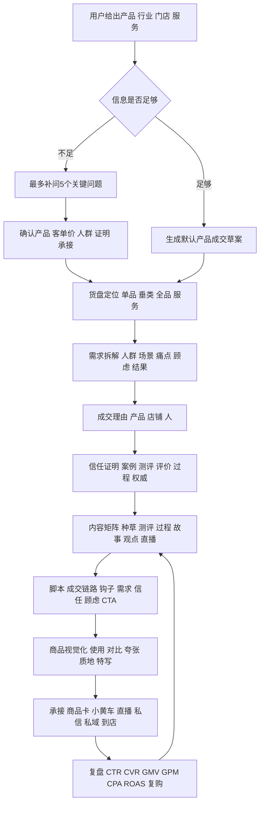
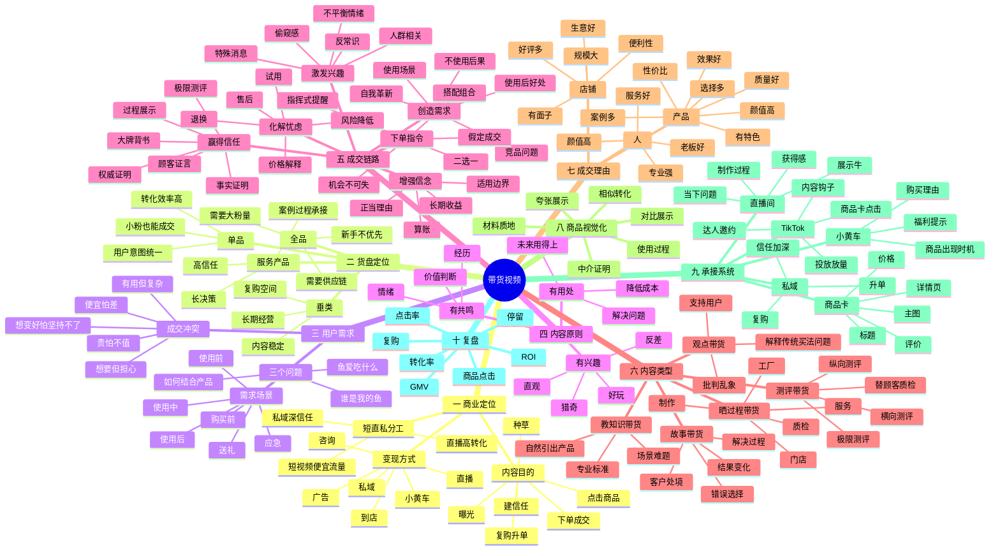
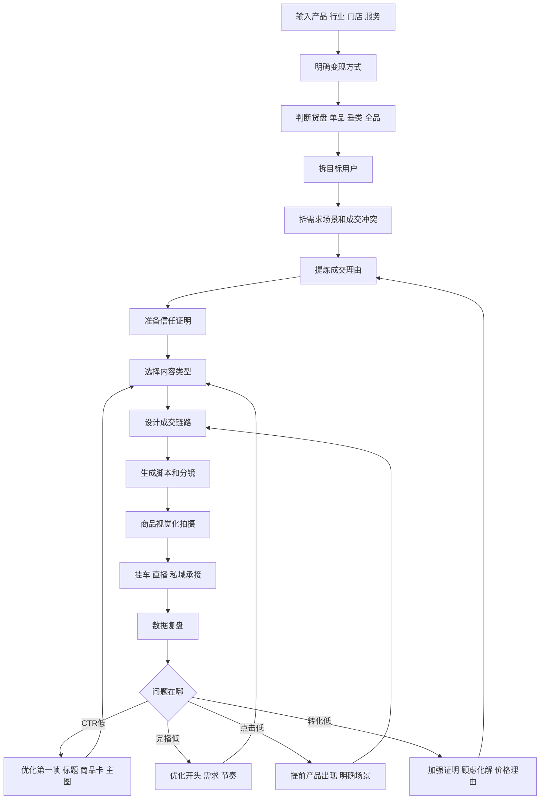

# 带货视频全知识库详细脑图和流程

## 使用定位

本文件只用于带货视频类需求。以后用户提出“我有产品想卖”“帮我做短视频带货”“帮我做直播间小黄车”“帮我做TikTok Shop”“实体店怎么拍成交视频”时，优先调用本文件。

输出不做泛泛建议，必须落到：产品需求拆解、目标人群、成交理由、信任证明、内容矩阵、选题、脚本、商品视觉化、直播或小黄车承接、私域承接、数据复盘。

## 带货视频专用调用流程



## 信息不足时先问5个问题

1. 你卖什么产品或服务，客单价多少？
2. 最想卖给哪类用户？
3. 产品最强成交理由是什么：效果、价格、特色、质量、案例、服务还是老板/专家背书？
4. 有哪些证明材料：评价、案例、检测、前后对比、过程、达人素材？
5. 用户看完后在哪里成交：小黄车、商品卡、直播间、私信、到店还是私域？

# 二 带货视频知识库

## 带货视频核心定义

带货视频不是把卖点硬塞进视频，而是：

```text
先创造用户需求
再降低信任成本
再降低行动成本
最后给明确成交指令
```

一条带货视频必须先判断目的：

- 硬转化：挂车、促单、让用户立刻行动。
- 软营销：做人设、建信任、降低后续成交成本。

两者不能在一条视频里混乱叠加。

## 带货视频详细脑图



## 带货视频整体流程



## 带货视频执行流程详解

### 1. 变现定位

常见路径：

| 路径 | 适合产品 | 核心动作 |
|---|---|---|
| 小黄车成交 | 标品、低客单、冲动消费 | 场景种草、强CTA、商品卡承接 |
| 直播成交 | 多SKU、需要讲解、需要互动 | 直播预热、福利、逼单 |
| 咨询引流 | 律师、教育、装修、美业、汽车 | 案例、避坑、私信承接 |
| 实体到店 | 餐饮、门店、美业、家居 | 门店理由、位置、团购、预约 |
| 私域复购 | 高客单、长期服务、多品类 | 信任、社群、复购升单 |
| TikTok Shop | 跨境货架商品 | 短视频兴趣种草、商品卡成交 |

### 2. 货盘判断

单品带货：

- 最适合新账号和小粉账号。
- 用户关注理由统一。
- 内容成本更低。
- 转化路径更短。
- 小流量也可能成交。

垂类带货：

- 适合长期经营一个品类。
- 有复购和多产品扩展空间。
- 内容主题更稳定。

全品带货：

- 需要更强供应链和更大粉丝量。
- 用户购买意图不统一。
- 新手不建议优先做。

### 3. 用户需求拆解

核心三问：

```text
谁是我的鱼
这条鱼爱吃什么
我如何把鱼爱吃的东西和我的行业或产品结合起来
```

需求必须依附于情境：

```text
目标人群 × 使用场景 × 当前问题 × 心理顾虑 × 理想结果
```

常见购买冲突：

- 生理想要，心理担心。
- 产品有用，但操作复杂。
- 孩子喜欢，父母担心风险。
- 便宜怕没质量，贵又怕不值。
- 想变好，又怕坚持不了。
- 想买，但怕被熟人评价。

### 4. 三有原则

带货内容至少满足一个，最好叠加：

| 原则 | 解释 | 内容方向 |
|---|---|---|
| 有用处 | 未来用得上、能解决问题、能降低成本 | 教知识、清单、避坑、测评 |
| 有兴趣 | 好玩、反差、猎奇、直观 | 极限测评、挑战、过程 |
| 有共鸣 | 击中用户经历、情绪、价值判断 | 故事、观点、吐槽 |

### 5. 成交心理链路

标准成交链：

```text
激发兴趣 -> 创造需求 -> 赢得信任 -> 增强信念 -> 化解忧虑 -> 下单指令
```

每一环的内容任务：

| 环节 | 要解决的问题 | 可用方法 |
|---|---|---|
| 激发兴趣 | 用户为什么停下 | 反差、痛点、特殊消息、视觉冲击 |
| 创造需求 | 用户为什么觉得需要 | 场景、后果、好处、对比 |
| 赢得信任 | 用户凭什么信 | 过程、案例、权威、测评、评价 |
| 增强信念 | 用户为什么觉得值 | 算账、长期收益、正当理由 |
| 化解忧虑 | 用户担心什么 | 售后、试用、退换、风险边界 |
| 下单指令 | 用户下一步做什么 | 点击、领取、评论、私信、进直播 |

### 6. 带货内容类型

教知识带货：

```text
用户场景难题
错误做法或风险放大
专业判断标准
解决步骤
自然引出产品或服务
CTA
```

晒过程带货：

```text
今天要完成什么
为什么值得看
关键过程
专业细节
困难或反差
结果展示
购买或咨询入口
```

测评带货：

- 横向测评：同类不同品牌对比。
- 纵向测评：一个产品多维度测评。
- 极限测评：耐用、安全、效果、成分。
- 替顾客质检：站在用户身边。

故事带货：

```text
客户处境
错误选择或巨大风险
转机出现
你如何判断和解决
结果变化
给同类用户的提醒
CTA
```

观点带货：

- 批判行业乱象。
- 支持被忽视的用户。
- 解释传统买法为什么不适合。
- 替用户说出不敢说的话。

### 7. 实体店成交理由

实体店不能只拍“我们家很好”，要把成交理由视频化。

产品维度：

- 效果好：结果明显。
- 性价比：同价更好，同款更便宜，赠品更多。
- 有特色：环境、菜品、服务、工艺不同。
- 选择多：产品种类多，一站式解决。
- 质量好：耐用、方便、安全、用料扎实。
- 案例多：成功案例多，说服力强。
- 颜值高：拍照好看、打卡属性强。

店铺维度：

- 好评多：客户夸赞、复购、转介绍。
- 有面子：限量、小众、难买、有品味。
- 便利性：近、省时、省力、使用方便。
- 生意好：顾客多、排队、断货。
- 规模大：面积大、设备全、员工多、连锁。

人的维度：

- 老板好：实在、大方、正直、有原则。
- 专业强：年限长、熟练、有奖项、有经验。
- 服务好：热情、耐心、响应快、售后负责。
- 颜值高：适合出镜，增强记忆点。

选题公式：

```text
行业或门店 × 成交理由 × 爆款元素 × 具体场景 = 带货选题
```

### 8. 商品视觉化

屏幕里必须让用户“看见理由”：

| 方法 | 用法 |
|---|---|
| 使用过程 | 让用户看到怎么用 |
| 夸张展示 | 放大面积、体积、数量、强度 |
| 对比展示 | 使用前后、竞品对比、场景对比 |
| 相似转化 | 把陌生质感转成熟悉感受 |
| 中介证明 | 用第三方物体证明性质 |
| 材料质地 | 通过声音、触感、纹理唤醒感官 |

### 9. 直播间和小黄车

直播间四类玩法：

| 玩法 | 适合内容 |
|---|---|
| 获得感强 | 教一个马上能学会的方法 |
| 解决当下问题 | 知识、服务、咨询类 |
| 展示牛 | 效果可视化，眼见为实 |
| 制作过程强 | 把操作过程可视化 |

带货讲法：

- 讲产地：产地加产品优势。
- 讲体验：使用前后、感官体验、真实反馈。
- 讲头牌：爆款、同款、大牌、明星、销量、好评。
- 讲价格：为什么值，为什么现在划算。

促单话术方向：

- 限时。
- 搭配。
- 二选一。
- 库存。
- 福利提醒。
- 售后保障。

## TikTok带货补充

TikTok电商是兴趣电商，核心是“货找人”。

TikTok内容链路：

```text
内容钩子 -> 激发兴趣 -> 建立信任 -> 引导点击商品卡或小黄车 -> 商品卡承接 -> 成交
```

TikTok需要同时优化三类数据：

| 类型 | 指标 | 优化方向 |
|---|---|---|
| 内容数据 | 完播、互动、分享、点击 | 前3秒、结构、情绪、CTA |
| 商品数据 | CTR、CVR、评价、价格、详情页 | 主图、标题、评论、价格、卖点 |
| 商业数据 | GMV、GPM、CPA、ROAS、ROI | 商品承接、投放、达人、复购 |

流量池逻辑：

- 基础流量池：200-500。
- 一般流量池：1000-5000。
- 中级流量池：10000-50000。
- 高级流量池：100000-500000。
- 终极流量池：100万以上。

核心权重：

```text
完播率 > 互动率 > 点击率
```

进入商业流量池后，GPM、转化成本、商品卡承接能力会影响继续推荐。

TikTok爆款结构：

```text
黄金3秒 = 精准人群 + 剧烈痛点 + 视觉冲击
痛点共鸣
产品引入
信任证明
转化引导
```

商品卡诊断：

| 现象 | 问题 |
|---|---|
| 高曝光低CTR | 主图、标题、价格不吸引 |
| 高点击低CVR | 详情页、评价、价格、信任不够 |
| 视频爆了但不成交 | 商品卡承接弱 |

TikTok短视频SOP：

1. 明确目标：产品、受众、卖点、考核指标。
2. 寻找对标：竞品、达人、同品类爆款。
3. 拆解爆款：钩子、结构、BGM、信任、CTA。
4. 整理素材库：痛点场景、产品特写、评价、证据。
5. 视频剪辑：标准化流水线生产。
6. 视频发布：标题、标签、商品卡关联、价格核对。
7. 数据观测：完播、互动、CTR、CVR、GMV。
8. 复盘优化：定位问题并决定下一轮动作。
9. 爆款复制：横向、纵向、矩阵复制。

爆款复制：

- 横向复制：同一产品换演员、场景、BGM、开头、口播版本。
- 纵向复制：把已验证的视频结构复用到同品类其他产品。
- 矩阵复制：将爆款视频投流加热，并作为信息流素材扩大收益。

达人邀约判断：

- 近30日GMV。
- 平均播放量。
- 粉丝画像。
- 评论区质量。
- 是否卖过类似品。
- 历史带货稳定性。

GMV Max投放前提：

- 商品已自然出单或有基础转化。
- 商品卡已优化。
- 有评价和基础信任。
- 有可用视频素材。
- ROI目标合理。

AI工作流：

```text
输入指令 -> 生成多个脚本标题创意 -> 人工筛选优化 -> 拍摄剪辑 -> 发布 -> 数据复盘 -> 反馈AI优化下一批指令
```

AI可用于：

- 脚本多版本。
- 标题。
- 长尾关键词。
- 分镜创意。
- 封面文案。
- AI配音。
- 数据复盘。
- 提示词库沉淀。

必须人工审核：

- 产品参数。
- 功效承诺。
- 合规风险。
- 本土化表达。

## 带货视频复盘表

| 问题 | 判断指标 | 优化动作 |
|---|---|---|
| 点击率低 | 封面、标题、第一帧弱 | 强化人群印记、视觉冲击、利益点 |
| 完播低 | 5秒后流失 | 强化需求、压缩铺垫、加冲突和节奏 |
| 互动低 | 点赞评论分享少 | 加观点、站队、评论问题 |
| 商品点击低 | 观看不点车 | 产品出现太晚、场景不明确、CTA弱 |
| 转化低 | 点击后不买 | 信任证明不足、顾虑未化解、价格理由弱 |
| 直播转化低 | 进房不买 | 话术弱、福利弱、互动弱、产品演示弱 |
| 私域转化低 | 加了不成交 | 承接话术、案例、报价、信任链不足 |
| 复购低 | 成交后不回购 | 交付体验、售后、产品矩阵不足 |


# 带货视频默认交付包

用户给具体产品时，默认输出：

1. 产品需求拆解。
2. 目标人群和购买情境。
3. 成交理由清单。
4. 信任证明清单。
5. 带货内容矩阵。
6. 5类带货选题。
7. 3-5条完整带货脚本。
8. 商品视觉化拍摄清单。
9. 直播或小黄车话术。
10. 私域或咨询承接。
11. 数据复盘动作。

## 带货视频 7天启动节奏

| 天数 | 任务 | 产出 |
|---|---|---|
| 第1天 | 明确产品、客单价、成交入口 | 产品成交草案 |
| 第2天 | 拆用户需求和购买顾虑 | 需求场景、成交冲突 |
| 第3天 | 提炼成交理由和信任证明 | 卖点证据表 |
| 第4天 | 生成选题和脚本 | 3-5条完整脚本 |
| 第5天 | 准备商品视觉素材 | 对比、特写、评价、过程素材 |
| 第6天 | 拍摄剪辑并挂接商品入口 | 成片、封面、标题、商品卡 |
| 第7天 | 发布复盘 | CTR、CVR、GMV优化动作 |

## 带货视频 30天内容节奏

- 第1周：测试不同需求场景。
- 第2周：测试不同成交理由。
- 第3周：测试不同脚本类型和商品视觉化。
- 第4周：复制高CTR和高CVR素材，进入直播、投流或达人合作。

## 后续调用格式

```text
一 信息判断
二 产品需求拆解
三 目标人群和购买情境
四 成交理由和信任证明
五 带货内容矩阵
六 选题库
七 完整带货脚本
八 商品视觉化拍摄清单
九 直播 小黄车 私域承接
十 数据复盘和优化动作
```
