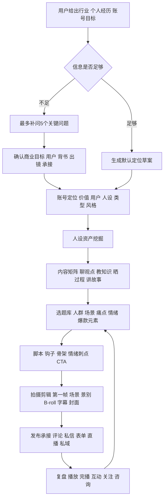
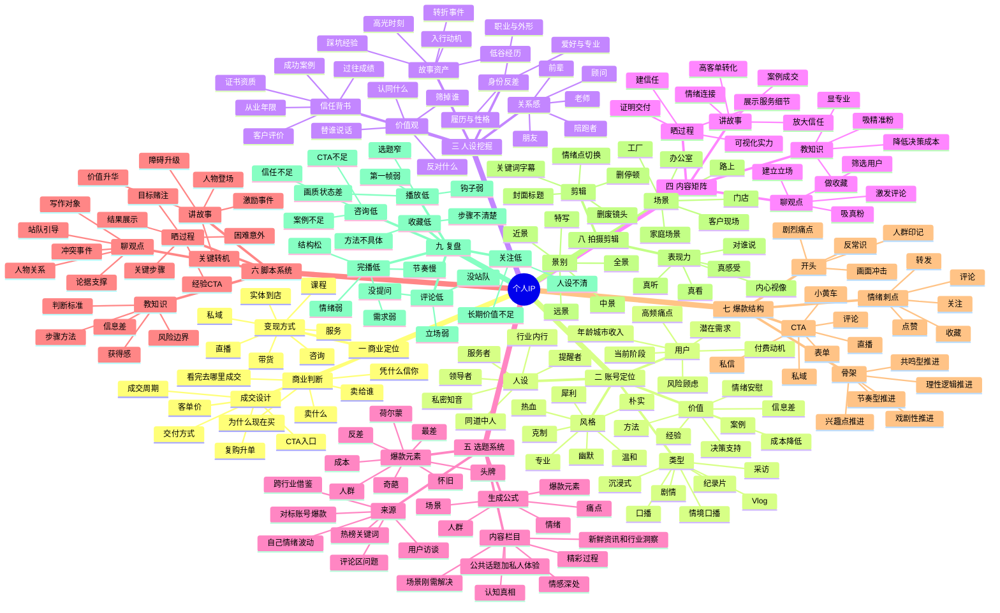
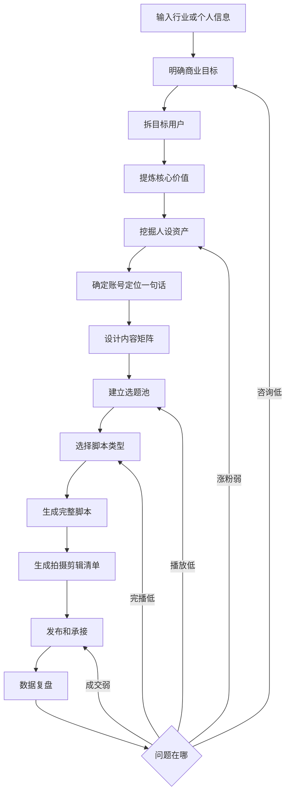

# 个人IP全知识库详细脑图和流程

## 使用定位

本文件只用于个人IP类需求。以后用户提出“我要做某行业IP”“帮我做律师/医生/教育/美业/实体老板个人IP”“帮我做账号定位、选题、脚本、起号计划”时，优先调用本文件。

输出不做泛泛建议，必须落到：定位文档、商业路径、用户画像、人设资产、内容矩阵、选题库、脚本、拍摄剪辑清单、承接方式、复盘动作。

## 个人IP专用调用流程



## 信息不足时先问5个问题

1. 你卖什么服务或产品，客单价多少？
2. 最想吸引哪类客户？
3. 你本人有什么资质、经验、案例、结果证明？
4. 能否真人出镜、直播、展示工作或服务过程？
5. 用户看完后要去哪里成交：评论、私信、表单、到店、直播还是私域？

# 一 个人IP知识库

## 个人IP核心定义

个人IP不是“把自己包装成某个人”，而是让观众形成一个稳定判断：

```text
这个人是谁
他服务谁
他凭什么可信
他能持续给我什么价值
我为什么愿意关注他
我为什么愿意向他咨询或购买
```

个人IP的核心公式：

```text
账号定位 = 价值 × 用户 × 人设 × 类型 × 风格
```

定位一句话模板：

```text
我是[身份/经验/角色]，
专门帮助[目标人群]解决[核心痛点]，
用[内容方式/专业方法]让他们获得[结果]，
最终通过[产品/服务/咨询/课程/直播/带货]变现。
```

## 个人IP详细脑图



## 个人IP整体流程



## 个人IP执行流程详解

### 1. 商业目标

先明确账号最终为什么而做：

| 商业目标 | 适合内容 | 承接动作 |
|---|---|---|
| 咨询 | 知识、观点、案例 | 私信、表单、电话 |
| 高客单服务 | 故事、过程、案例 | 私信、私域、面诊 |
| 实体到店 | 过程、体验、结果 | 团购、地址、预约 |
| 课程 | 知识、体系、案例 | 直播、私域、表单 |
| 带货 | 测评、过程、种草 | 小黄车、直播间 |
| 私域 | 情绪、信任、陪伴 | 评论、私信、社群 |

### 2. 目标用户

用户画像不是泛泛写年龄，而是回答：

- 他是谁？
- 他现在卡在哪个阶段？
- 他最焦虑的问题是什么？
- 他最想要的结果是什么？
- 他最怕的风险是什么？
- 他为什么现在还没有解决？
- 他愿意为什么付费？
- 他刷到什么内容会停下来？

用户拆解公式：

```text
目标用户 = 人群身份 + 当前阶段 + 具体场景 + 明确痛点 + 潜在需求 + 付费动机
```

### 3. 价值定位

个人IP的价值来源包括：

- 方法：让用户知道怎么做。
- 信息差：让用户知道以前不知道的。
- 经验：替用户承担踩坑成本。
- 案例：让用户看到真实结果。
- 情绪价值：让用户感觉被理解。
- 决策支持：让用户知道怎么选。
- 成本降低：省钱、省时间、省精力、省风险。

价值定位要避免两个极端：

- 只有价值观，没有可执行帮助。
- 只有工具感，没有人设和关系感。

### 4. 人设关系

人设不是自我介绍，而是观众对你的综合印象。常见关系：

| 人设关系 | 适合行业 | 表达重点 |
|---|---|---|
| 提醒者 | 律师、财税、医生、装修 | 风险、避坑、提醒 |
| 服务者 | 实体店、美业、家政、教育 | 细节、耐心、过程 |
| 领导者 | 商业、管理、培训 | 判断、方向、决策 |
| 同道中人 | 情感、成长、副业 | 陪伴、真实、共鸣 |
| 私密知音 | 女性成长、亲密关系 | 情绪、理解、接纳 |
| 行业内行 | 汽车、装修、供应链 | 内幕、标准、经验 |

### 5. 内容矩阵

默认四条内容线：

| 内容线 | 目的 | 适合脚本 | 典型选题 |
|---|---|---|---|
| 聊观点 | 吸真粉、立场、评论 | 观点型 | 替用户说话、批判乱象、反常识 |
| 教知识 | 显专业、收藏、精准粉 | 解题、案例、推荐、揭秘 | 高频误区、判断标准、步骤方法 |
| 晒过程 | 建信任、展示实力 | 过程、测评、挑战、体验 | 服务过程、制作过程、客户现场 |
| 讲故事 | 高信任转化 | 案例、小成就、苦难、平凡英雄 | 客户案例、个人经历、行业故事 |

内容矩阵的比例可以按阶段调整：

| 阶段 | 聊观点 | 教知识 | 晒过程 | 讲故事 |
|---|---:|---:|---:|---:|
| 起号期 | 35% | 35% | 20% | 10% |
| 建信任期 | 20% | 30% | 30% | 20% |
| 转化期 | 15% | 25% | 30% | 30% |
| 稳定期 | 25% | 25% | 25% | 25% |

### 6. 选题生成

选题公式：

```text
目标用户 × 具体场景 × 情绪或痛点 × 爆款元素 = 可拍选题
```

选题优先级：

1. 人群印记：第一秒让精准用户知道和自己有关。
2. 潜在需求：用户还没明确搜索，但看见会被击中。
3. 情绪立场：有观点、有态度、有冲突。
4. 陌生化表达：熟悉问题换一个新角度讲。
5. 公域扩散：让非精准用户也愿意多看几秒。

8类爆款元素：

| 元素 | 用法 | 示例方向 |
|---|---|---|
| 成本 | 钱、时间、精力、风险、面子 | 花小钱办大事、别替别人承担试错成本 |
| 人群 | 指向特定身份 | 新手、宝妈、老板、第一次买房的人 |
| 奇葩 | 反常识、离谱、内幕 | 外行不知道的行业操作 |
| 最差 | 吐槽、避坑、反面案例 | 最容易踩的坑、最不建议的做法 |
| 反差 | 前后、贫富、南北、男女 | 同一个问题，不同人做法完全不同 |
| 怀旧 | 时间对比、旧方法 | 十年前有效，现在失效的做法 |
| 荷尔蒙 | 吸引力、社交评价、变美变强 | 更有吸引力的细节 |
| 头牌 | 权威、最贵、最牛、大牌 | 头部玩家为什么这么做 |

### 7. 四类脚本卡

教知识脚本：

```text
场景难题或危机前置
错误做法或常见误区
低行动成本解决方案
具体步骤或判断标准
风险提醒或适用边界
CTA
```

晒过程脚本：

```text
今天要完成什么目标
为什么值得看
关键步骤1
关键步骤2
困难或意外
关键步骤3
结果展示
经验总结或CTA
```

讲故事脚本：

```text
人物登场
激励事件
欲望产生
障碍升级
关键转机
结果释放
价值升华
CTA
```

聊观点脚本：

```text
写作对象
人物关系
冲突事件
明确立场
论据1
论据2
反方预判
站队或提问CTA
```

### 8. 拍摄呈现

拍摄前先确定：

- 我为什么说这句话？
- 我在对谁说？
- 对方现在是什么状态？
- 我希望对方听完做什么？
- 这条内容需要专业感、生活感、压迫感、亲近感还是现场感？

口播可切换视角：

- 自拍：真实、亲近、生活感。
- 偷拍感：自然、过程感、信任感。
- 采访：权威、客观、第三方视角。
- 聊天：放松、陪伴、共鸣。

景别使用：

| 景别 | 作用 |
|---|---|
| 远景 | 交代环境 |
| 全景 | 交代人物关系 |
| 中景 | 看动作和状态 |
| 近景 | 看情绪 |
| 特写 | 看细节和证据 |

### 9. 剪辑原则

剪辑顺序：

1. 先删废镜头、重复镜头、停顿、气口。
2. 再根据情绪变化和关键信息切点。
3. 字幕一行尽量短，关键词可突出。
4. 花字、贴纸、音效只服务重点。
5. 封面要清晰，有人脸或核心对象，标题聚焦中心内容。

### 10. 个人IP复盘表

| 问题 | 判断 | 优化动作 |
|---|---|---|
| 播放低 | 初始曝光后不扩散 | 换选题、换第一帧、强化人群印记 |
| 2秒跳出高 | 第一帧或开头弱 | 第一秒放痛点、结果、反差 |
| 完播低 | 中段留不住 | 加悬念、拆步骤、提高信息密度 |
| 评论低 | 互动弱 | 加立场、站队、提问、争议点 |
| 收藏低 | 工具价值弱 | 给清单、步骤、模板、判断标准 |
| 关注低 | 人设不清 | 强化身份、系列感、长期价值 |
| 咨询低 | 信任不足 | 加案例、过程、结果证明、明确CTA |
| 成交低 | 承接弱 | 梳理产品、价格理由、顾虑化解 |


# 个人IP默认交付包

用户只给一个行业时，默认输出：

1. 信息判断和待确认项。
2. IP定位一句话。
3. 商业定位。
4. 目标用户画像。
5. 人设定位。
6. 内容矩阵。
7. 30个选题。
8. 7天起号计划。
9. 3-5条完整脚本。
10. 拍摄剪辑清单。
11. 发布承接方案。
12. 复盘指标和优化动作。

## 个人IP 7天启动节奏

| 天数 | 任务 | 产出 |
|---|---|---|
| 第1天 | 填采集表、定商业目标 | 定位草案、待确认项 |
| 第2天 | 用户画像和人设挖掘 | 用户痛点、信任背书、人设关系 |
| 第3天 | 内容矩阵和选题池 | 30个选题 |
| 第4天 | 脚本生产 | 3-5条完整脚本 |
| 第5天 | 拍摄准备和素材采集 | 场景、道具、B-roll、证明材料 |
| 第6天 | 拍摄剪辑 | 成片、封面、标题、CTA |
| 第7天 | 发布复盘 | 数据表、下一轮优化方向 |

## 个人IP 30天内容节奏

- 第1周：人群印记和痛点选题，快速测试用户匹配度。
- 第2周：知识和观点并行，测试关注和收藏。
- 第3周：过程和故事增加信任，加入咨询CTA。
- 第4周：复制有效结构，形成系列内容和承接闭环。

## 后续调用格式

```text
一 信息判断
二 IP定位文档
三 商业定位
四 用户画像
五 人设资产
六 内容矩阵
七 选题库
八 完整脚本
九 拍摄剪辑清单
十 发布承接与复盘优化
```
