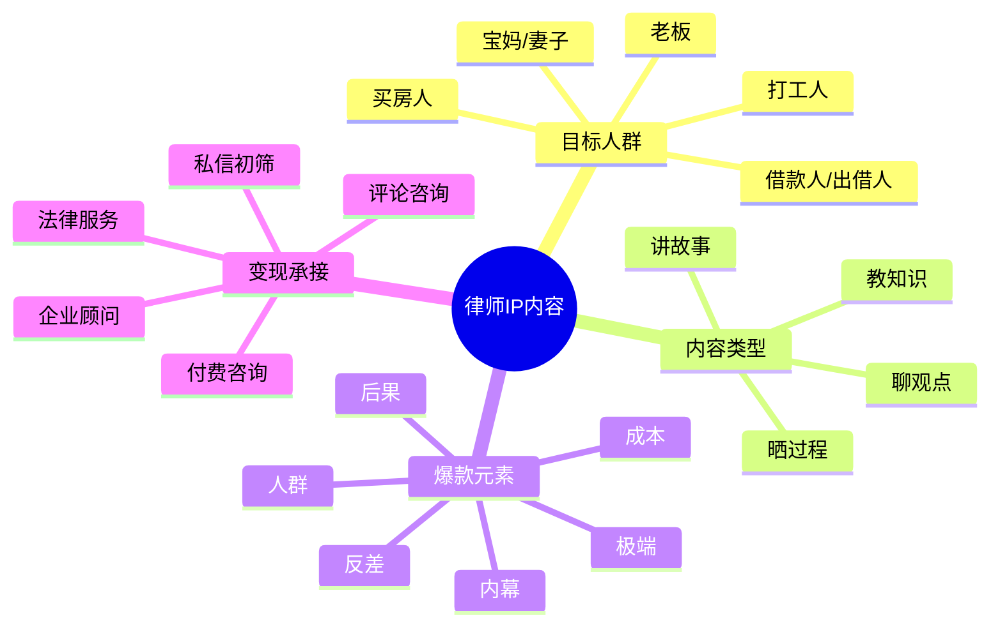

# 律师行业IP启动模板

## 适用场景

当用户提出“我要做律师行业IP”但信息不完整时，先用本模板启动，再让用户补充采集表。

## 默认定位方向

```text
我是[某领域律师/法律顾问]，
专门帮助[目标人群]避开[高频法律风险]，
用真实案例拆解和通俗法律解释，
让他们在遇到纠纷前知道该怎么做。
```

## 律师IP常见细分

- 婚姻家事律师。
- 劳动争议律师。
- 刑事辩护律师。
- 企业法律顾问。
- 房产纠纷律师。
- 合同纠纷律师。
- 交通事故律师。
- 知识产权律师。
- 债务纠纷律师。

## 内容栏目设计

### 1. 聊观点：吸真粉

目标：让用户觉得律师懂人情、懂处境，不只是讲法条。

示例：

- 婚姻里最可怕的不是离婚，是你连证据都不知道怎么留。
- 打工人不是不懂法，是很多公司赌你不敢维权。
- 借钱不还的人最怕的不是你生气，是你开始按流程做事。

### 2. 教知识：显专业

目标：让用户知道具体怎么做。

示例：

- 被公司辞退，先别签这三类文件。
- 借条上少写这句话，钱可能很难要回来。
- 离婚前最该提前准备的5类证据。

### 3. 晒过程：建信任

目标：展示律师工作过程和专业判断。

示例：

- 我今天帮客户看合同，第一眼先找这3个坑。
- 一个劳动仲裁案，律师真正会先看什么？
- 接到咨询后，我不会立刻让你起诉，先判断这件事值不值得打。

### 4. 讲故事：高信任转化

目标：用匿名案例建立信任和咨询欲望。

示例：

- 她离婚前只做对了一件事，最后少吃了很大亏。
- 一个老板差点因为合同里这一行字赔几十万。
- 他以为聊天记录没用，结果恰恰是关键证据。

## 选题生成流程



## 律师行业合规边界

- 不承诺案件结果。
- 不虚构胜诉率。
- 不泄露客户隐私。
- 案例必须匿名化。
- 不诱导用户制造证据。
- 不做绝对化保证。
- 不用“包赢”“必胜”“百分百”等表达。
- 对具体案件要提示以实际材料为准。

## 7天启动内容计划

| 天数 | 内容类型 | 选题方向 | 目标 |
|---|---|---|---|
| D1 | 聊观点 | 替目标人群说一句话 | 建立同频 |
| D2 | 教知识 | 一个高频法律误区 | 展示专业 |
| D3 | 晒过程 | 律师如何看材料 | 建立信任 |
| D4 | 讲故事 | 匿名案例反转 | 提升咨询欲 |
| D5 | 教知识 | 三步处理流程 | 收藏转发 |
| D6 | 聊观点 | 批判行业/关系乱象 | 吸真粉 |
| D7 | 讲故事 | 成本/后果型案例 | 转化咨询 |

## 默认脚本模板

### 聊观点

```text
开头：很多人遇到[法律问题]时，第一反应是[错误做法]。

观点：但我想说，[站在目标用户一边的观点]。

论据1：[为什么他这么做可以理解]

论据2：[如果继续这样会有什么后果]

结尾：法律不是让你去吵赢别人，是让你在关键时刻别把自己交出去。

CTA：你可以把情况简单写在评论区，我告诉你第一步先看什么。
```

### 教知识

```text
开头：[目标人群]遇到[问题]，先别急着[错误动作]。

步骤1：
步骤2：
步骤3：

提醒：具体能不能这么做，要看你的材料和时间节点。

CTA：想要我整理一版检查清单，可以评论“清单”。
```

