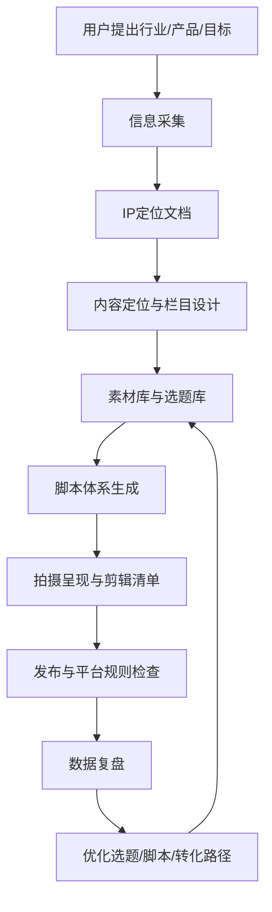

# 知识库调用工作流

## 用途

以后当用户提出某个行业、产品、账号或变现需求时，不只给知识目录，而是按本课程知识库输出可执行方案：

- IP定位。
- 内容定位。
- 选题规划。
- 脚本生成。
- 拍摄执行。
- 发布运营。
- 复盘优化。
- 变现承接。

## 总流程



## 第一步：信息采集

如果信息不足，先让用户填写 `IP定位采集表.md`。

必要信息包括：

- 行业/赛道。
- 目标客户。
- 具体服务或产品。
- 客单价。
- 变现路径。
- 地域限制。
- 合规边界。
- 创作者身份与经历。
- 可出镜程度。
- 可用案例与证明。
- 内容产能。

如果用户只给了行业，也可以先输出一个“默认版IP定位草案”，再让用户确认。

## 第二步：IP定位

对应课程：

- V002 短视频营销底层逻辑。
- V013 短视频平台4大变现方式。
- V020 能变现的内容定位与粉丝经济。
- V025-V026 聊观点脚本。

输出内容：

- 账号定位一句话。
- 目标人群。
- 人设角色。
- 信任来源。
- 差异化表达。
- 变现路径。
- 内容边界。
- 不能说/不该说的话。

定位公式：

```text
我是[身份/经验/角色]，
专门帮助[目标人群]解决[核心痛点]，
用[内容方式/专业方法]让他们获得[结果]，
最终通过[产品/服务/咨询/课程/直播/带货]变现。
```

## 第三步：内容结构

对应课程：

- V021 素材库搭建。
- V022 8大爆款元素选题技巧。
- V023 情绪波点创作法。
- V024 文案写作基础课。

输出内容：

- 3-5个内容栏目。
- 每个栏目服务的目标。
- 每个栏目适用脚本类型。
- 选题库搭建方法。
- 一周/一月发布节奏。

栏目建议按课程四类脚本建立：

```text
聊观点：吸真粉、立价值观。
晒过程：建立信任、展示服务/产品过程。
教知识：展示专业、解决用户具体问题。
讲故事：讲案例、成交高信任客户。
```

## 第四步：选题生成

对应课程：

- V021 素材库搭建。
- V022 8大爆款元素选题技巧。
- V025 聊观点脚本1。

选题输出规则：

- 先给普通选题。
- 再叠加爆款元素。
- 再判断人群、场景、成本、反差、内幕、风险。
- 最后拆成系列。

选题公式：

```text
基础方向 + 爆款元素 + 目标人群
```

爆款元素：

- 人群。
- 成本。
- 极端。
- 反差。
- 怀旧。
- 名人/大牌/富豪。
- 内幕/黑幕/外行不知道。
- 猎奇/离谱/奇怪。

## 第五步：脚本生成

对应课程：

- V003-V004 晒过程脚本。
- V005-V006 教知识脚本。
- V007-V008 讲故事脚本。
- V016 产品卖爆4P法则。
- V023 情绪波点创作法。
- V024 文案写作基础课。
- V025-V026 聊观点脚本。

默认脚本输出格式：

```text
标题/角度：
目标人群：
脚本类型：
时长：
0-3秒开头：
正文口播：
屏幕字幕：
镜头/画面：
B-roll：
CTA：
风险提示：
```

脚本选择规则：

- 要吸真粉：聊观点。
- 要展示专业：教知识。
- 要建立信任：晒过程。
- 要成交高客单：讲故事。
- 要带产品：4P法则。

## 第六步：拍摄呈现

对应课程：

- V009 拆片技巧。
- V010 表现力技巧课。
- V011 场景置景课。
- V012 拍摄呈现基础课。
- V014 拍摄呈现进阶课。
- V015 短视频剪辑基础课。

输出内容：

- 第一帧画面。
- 人物状态。
- 场景建议。
- 道具建议。
- 镜头顺序。
- 字幕重点。
- 封面文字。
- 剪辑节奏。

## 第七步：发布与运营

对应课程：

- V017 平台规则避坑课。
- V018 DOU+投放策略。
- V019 直播间搭建与玩法。

输出内容：

- 标题。
- 封面字。
- 话题标签。
- 评论区引导。
- 发布时间建议。
- 挂车/咨询/私域承接方式。
- 违规风险检查。
- 是否适合DOU+测试。
- 是否适合直播承接。

## 第八步：复盘

复盘指标：

- 2秒跳出。
- 5秒完播。
- 平均停留。
- 点赞。
- 评论。
- 收藏。
- 转发。
- 关注。
- 私信/咨询。
- 商品点击。
- 成交。

复盘动作：

```text
低停留：优化开头和画面。
低互动：增强观点和情绪。
低关注：加强人设和金句。
低咨询：补信任和案例。
低成交：补4P、痛点、证明和促单。
```

## 标准输出包

当用户给出一个行业或产品后，默认输出：

1. IP定位文档。
2. 内容规划流程图。
3. 账号栏目设计。
4. 30个选题。
5. 5条可拍脚本。
6. 拍摄执行清单。
7. 发布与复盘表。

如果用户时间紧，先输出：

1. 一页版IP定位。
2. 7天起号内容计划。
3. 3条脚本。

