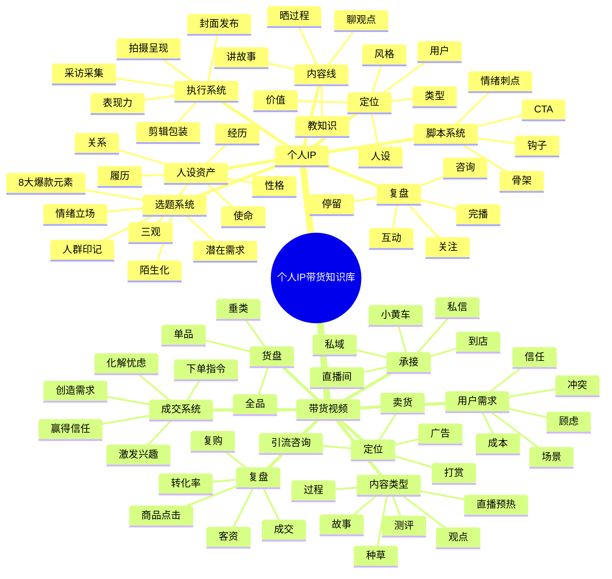
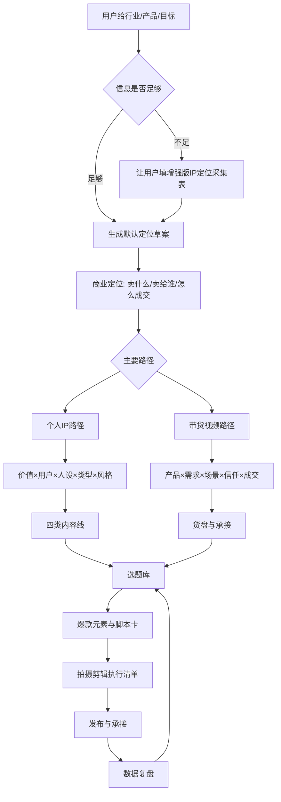

# 个人IP带货总应用手册

## 定位

本知识库以后只按两类调用：

- 个人IP。
- 带货视频。

课程名、文件名、资料包名只作为来源，不作为分类。

当用户提出一个行业、产品、账号或变现目标时，不输出泛泛建议，而是按本手册生成：

- IP定位。
- 商业定位。
- 内容矩阵。
- 选题库。
- 脚本。
- 拍摄剪辑清单。
- 直播/小黄车/私域承接。
- 数据复盘和下一轮动作。

## 已学习资料

- 三大体系百万大V短视频营销课：26 个视频，已生成课程笔记和应用模板。
- 线下编导训练中心视频课：65 个视频，已完整转写。
- 薛辉线下达人班：文档、表格、PDF、图片课件、脚本卡、AI提示词，已转写/OCR。
- 直播间小黄车精品账号定位课：1 个视频，已完整转写。

## 总脑图



## 标准调用流程



## 个人IP工作流

### 1. 定位

公式：

```text
我是[身份/经验/角色]，
专门帮助[目标人群]解决[核心痛点]，
用[内容方式/专业方法]让他们获得[结果]，
最终通过[产品/服务/咨询/课程/直播/带货]变现。
```

必须明确：

- 给谁提供价值。
- 用户现在处在什么情境。
- 你凭什么可信。
- 你和同行的差异。
- 你要吸引谁、筛掉谁。
- 哪些话不能说。

### 2. 内容矩阵

- 聊观点：立场、吸真粉、评论互动。
- 教知识：专业、收藏、精准粉。
- 晒过程：信任、过程可视化、服务/产品证明。
- 讲故事：案例、情绪、成交信任。

### 3. 选题

```text
目标用户 × 具体场景 × 情绪/痛点 × 爆款元素
```

爆款元素：

- 成本。
- 人群。
- 奇葩/猎奇。
- 最差。
- 反差/对立。
- 怀旧/古代。
- 荷尔蒙。
- 头牌。

### 4. 脚本

每条脚本必须包含：

- 0-3秒人群印记和钩子。
- 中段骨架：兴趣点、戏剧性、共鸣、逻辑或节奏推进。
- 情绪刺点：点赞、评论、收藏、转发、关注。
- CTA：评论、私信、表单、直播、小黄车或私域。

## 带货视频工作流

### 1. 变现判断

- 有明确产品/服务：围绕产品或服务做定位。
- 没有明确产品：优先带货，不建议先做泛流量。
- 高客单服务：多用引流咨询、案例故事、晒过程。
- 实物低客单：多用小黄车、测评、场景种草。

### 2. 货盘定位

- 单品：最容易小粉丝变现。
- 垂类：适合长期经营和复购。
- 全品：需要更大粉丝量和更强供应链，不建议新手优先。

### 3. 三有原则

内容至少满足一个：

- 有用处：能解决问题或未来用得上。
- 有兴趣：好玩、反差、猎奇、围观。
- 有共鸣：击中用户情绪和价值判断。

### 4. 成交链路

```text
激发兴趣 -> 创造需求 -> 赢得信任 -> 化解忧虑 -> 下单指令
```

### 5. 实体店成交理由

- 产品：效果好、性价比、有特色、选择多、质量好、案例多、颜值高。
- 店铺：好评多、有面子、便利性、生意好、规模大。
- 人：老板好、专业强、服务好、颜值高。

## 默认输出包

用户只给一个行业时，输出：

1. IP定位文档。
2. 商业定位。
3. 用户画像。
4. 内容矩阵。
5. 30个选题。
6. 7天起号计划。
7. 3-5条完整脚本。
8. 拍摄剪辑清单。
9. 发布与复盘表。

用户给具体产品时，输出：

1. 产品需求拆解。
2. 成交理由。
3. 信任证明。
4. 带货内容矩阵。
5. 短视频脚本。
6. 直播/小黄车话术。
7. 私域/咨询承接。
8. 转化复盘。

## 关键模板位置

- 新资料总流程：`知识库/新学习资料/知识库总流程与脑图.md`
- 个人IP方法库：`知识库/新学习资料/个人IP/个人IP方法库.md`
- 爆款选题与脚本卡片库：`知识库/新学习资料/个人IP/爆款选题与脚本卡片库.md`
- 素材采集与拆片流程：`知识库/新学习资料/个人IP/素材采集与拆片流程.md`
- 带货视频方法库：`知识库/新学习资料/带货视频/带货视频方法库.md`
- TikTok运营方法库：`知识库/新学习资料/带货视频/TikTok运营方法库.md`
- 增强版采集表：`知识库/新学习资料/应用模板/增强版IP定位采集表.md`
- 行业方案默认输出模板：`知识库/新学习资料/应用模板/行业方案默认输出模板.md`
- 旧课程应用模板：`知识库/个人IP带货类/三大体系百万大V短视频营销课/应用模板`

## 使用承诺

以后你提出具体需求时，我会先调用这个知识库，而不是从零散经验回答。信息不足时，我先问关键问题；信息足够时，我直接给定位、流程图、选题、脚本和执行清单。
