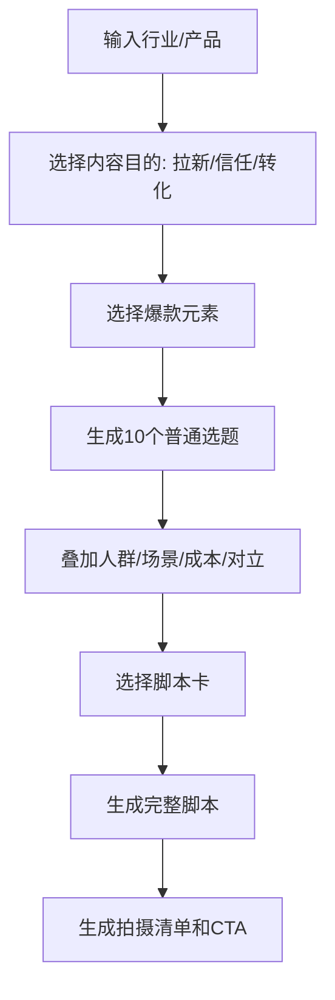

# 爆款选题与脚本卡片库

## 用途

当用户给出一个行业、产品或账号方向时，用本库快速生成：

- 爆款选题。
- 脚本类型。
- 钩子。
- 论据。
- 拍摄方向。
- 拆片分析表。

## 全行业策划转盘

使用方式：

```text
行业 × 内容方向 × 爆款元素 = 可拍选题
```

内容方向：

- 改造。
- 体验。
- 解决。
- 经历。
- 制作过程。
- 测评产品。
- 任务挑战。
- 事件体验。

爆款元素：

- 成本。
- 人群。
- 奇葩。
- 最差。
- 反差。
- 怀旧。
- 荷尔蒙。
- 头牌。

示例：

```text
白酒行业 × 制作过程 × 头牌
= 探访某头牌白酒的核心制作过程
```

## 8类爆款元素生成器

### 1. 头牌

适合借大牌、名人、名企、最贵、最牛、最权威打开好奇心。

句式：

- 世界上最贵的[行业物品]到底有多贵？
- 明星/头部人物用的[产品]到底值多少钱？
- 最牛的[行业人物/机构]到底牛在哪？
- 最贵的[产品/服务]到底好在哪？

### 2. 怀旧与古代

适合把当下行业放进时间维度，制造陌生感。

句式：

- 20年前经典的[行业事物]。
- 古代人是如何解决[行业问题]的？
- 小时候那些难忘的[行业记忆]。
- 当年最火的[产品/服务/玩法]。
- 曾经那些价值不菲的[行业物品]。

### 3. 对立

适合制造站队、比较和评论。

句式：

- 穷人 vs 富人做[行业行为]的区别。
- 南方人 vs 北方人对[产品/服务]的不同看法。
- 男人 vs 女人在[行业场景]里的选择差异。
- 中国人 vs 外国人如何理解[行业问题]。
- 古代 vs 现代的[行业做法]。
- 有良心 vs 没良心的[行业从业者]。
- 曾经 vs 现在的[行业变化]。

### 4. 最差

适合吐槽、避坑、测评、行业内幕。

词根：

- 贬值最快的。
- 最难吃/难用/难看/没面子的。
- 差评最多的。
- 拼多多9块9的。
- 反人类设计的。

要求：不要强行硬加，必须和行业真实痛点相关。

### 5. 荷尔蒙

适合穿搭、健身、美业、情感、社交、餐饮、生活方式等。

句式：

- 相亲成功率高的[做法/产品]。
- 异性会多看你两眼的[细节]。
- 最有吸引力的[行业选择]。
- 一秒下头的[行为/产品/搭配]。
- 自以为很帅/漂亮/好，实际对方眼里很差的[行为]。
- 去丈母娘家能不能先动筷的[社交细节]。
- 必被闺蜜/哥们吐槽的[选择]。

## 6. 猎奇

适合内幕、反常识、奇葩设计、外行不知道的操作。

句式：

- 脑回路有问题的[行业操作]。
- 外行人绝对不知道的[行业真相]。
- 黑心内幕操作的[行业环节]。
- 内行人的神奇操作。
- 匪夷所思的[行业行为]。

## 7. 特定人群

适合把泛选题变成精准人群选题。

人群维度：

- 星座。
- 内向/外向。
- MBTI。
- 身价/阶层。
- 第一次体验。
- 弱势群体。
- 新手/老手。
- 宝妈/老板/学生/上班族/中年人/退休人群。

句式：

```text
[特定人群]遇到[行业场景]时，最容易踩的坑
[特定人群]第一次体验[产品/服务]会发生什么
[特定人群]为什么更需要[解决方案]
```

## 8. 成本

成本不只是钱，也包括时间、面子、力气、决策风险。

句式：

- 便宜又有面子的[行业方案]。
- 十分之一金钱就能完成的[结果]。
- 十分之一时间就能完成的[结果]。
- 薅羊毛还能保持体面的[做法]。
- [行业人群]如何偷懒。
- [行业人群]如何贪小便宜。
- 花超大钱做[事情]会怎样。
- 花小钱办大事的[方法]。

## 教知识脚本卡

### 解题型

```text
场景难题/放大危机
低行动成本解决问题
具体步骤
风险提醒
```

### 案例型

```text
热点/成功/失败/名人/影视案例
从案例提取知识点
用户如何应用
```

### 推荐型

```text
美好愿景/圈定人群/引发好奇
推荐内容1-3
推荐理由
适用边界
```

### 揭秘型

```text
揭秘事件
内幕产生原因：利益链路/生产方式/行业标准
如何避免/正向呼吁
```

## 晒过程脚本卡

火车节模型：

```text
起因 + 关键步骤1 + 关键步骤2 + 关键步骤3 + 结果
```

操作：

1. 先确定脚本方向：制作过程、测评产品、任务挑战、事件体验。
2. 再写主线事件。
3. 给关键车厢放钩子。
4. 用钩子增强期待感和完播。

六类钩子：

- 送温暖：帮助弱者、给特殊人群送礼物、体面地帮助别人。
- 金钱：花大钱、花小钱办大事、薅羊毛、赚钱、省钱。
- 对抗：下赌注、吵架、被阻止、发生意外、故意整蛊。
- 盲盒：抽到什么穿什么、吃什么、用什么、做什么。
- 验证/揭秘：挑战权威、验证价格、验证成分、揭秘真假。
- 维度升级/荷尔蒙：不讲事实本身，而是讲更能调动情绪的维度。

## 观点脚本卡

### 人群观点

```text
写作对象 × 人物关系 × 冲突事件 = 观点选题
```

人物关系：

- 家庭关系：公婆、父母、兄弟姐妹、子女、夫妻。
- 社会关系：闺蜜、邻居、朋友、同学、舍友、明星。
- 工作关系：领导、下属、老板、客户、竞争对手。

### 行业观点

```text
行业 × 产品/从业者/消费者 × 误解/批判/支持/建议
```

论据类型：

- 权衡利弊。
- 无奈之举。
- 不同视角。
- 人身攻击。
- 倒打一耙。
- 维度升级。

## 讲故事脚本卡

### 使用方式

1. 先选脚本类型。
2. 再抽取第一轮困境和转机。
3. 再抽取第二轮困境和转机。
4. 根据困境转机丰富情节。
5. 最后写感悟或释怀。

基础结构：

```text
脚本类型
第一轮困境
第一轮转机
第二轮困境
第二轮转机
感悟/释怀
```

常见脚本类型：

- 小有成就型。
- 成功案例型。
- 平凡英雄型。
- 苦难经历型。
- 重走成功路型。

## 拆片表

用于分析爆款和对标账号。

| 维度 | 记录内容 |
|---|---|
| 内容类型 | 故事 / 知识 / 过程 / 观点 / 产品 / 其他 |
| 主题IP策划 | 这条视频服务什么账号定位 |
| 爆款元素 | 成本 / 人群 / 奇葩 / 最差 / 反差 / 怀旧 / 荷尔蒙 / 头牌 |
| 人设 | 体现了什么身份、性格、关系 |
| 写作对象 | 对谁说 |
| 选题类型 | 行业 / 人群 / 场景 / 产品 / 情绪 |
| 脚本结构 | 用了什么骨架 |
| 拍摄剪辑和特效 | 第一帧、景别、运镜、字幕、音效 |
| 经典镜头特效 | 可复用画面 |
| 文案情绪/句式 | 可复用表达 |

## 生成流程


