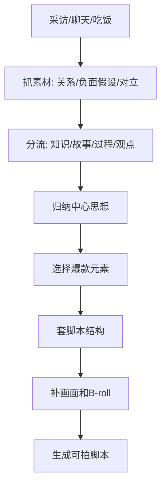

# 素材采集与拆片流程

## 素材库五个文件夹

```text
选题
脚本结构
开篇结尾
呈现方式
音乐
```

每个文件夹都要继续细分，素材不是收藏后堆着，而是为了未来生成脚本。

## 素材来源

- 抖音、快手、视频号：找同领域选题和爆款内容。
- 小红书：找封面字、生活场景、用户情绪。
- 知乎、百度：找问题、金句、长尾需求。
- 巨量算数：找关键词关联和趋势。
- 热榜：今日热榜、微博热搜、抖音热榜。
- 评论区：找真实顾虑、高频词、舆论方向。
- 跨领域账号：找呈现方式和拍法。

## 一顿饭拍出多条内容

核心：不是机械采访，而是从一个人的关系、经历、情绪和冲突里拆素材。

### 1. 亲密关系

可追问：

- 和父母/伴侣/孩子/合伙人之间最难忘的事。
- 有没有被误解、支持、背叛、帮助的时刻。
- 做这件事时，身边人怎么看。
- 你最想对某个人说什么。

适合产出：

- 讲故事。
- 情感深处。
- 人设信任。
- 价值观表达。

### 2. 负面假设

可追问：

- 如果当初没有做这个选择，会怎样？
- 如果最坏的情况发生，你最怕什么？
- 如果客户继续用错误方法，会付出什么代价？
- 如果你是用户，你最担心什么？

适合产出：

- 教知识开头。
- 观点型批判。
- 成交风险提醒。
- 带货痛点放大。

### 3. 制造对立

对立来源：

- 南北。
- 男女。
- 古今。
- 新手/老手。
- 内行/外行。
- 消费者/商家。
- 老板/员工。
- 富人/普通人。
- 有良心/没良心。

适合产出：

- 聊观点。
- 评论互动。
- 爆款选题。
- 行业真相。

## 采访前准备

- 了解IP本人。
- 了解IP行业。
- 浏览近半年最火的10条同领域视频。
- 掌握15个行业名词或入门知识。
- 搜索5个行业相关热门事件。
- 准备亲密关系、负面假设、制造对立三类问题。

## 现场引导

- 前期破冰：不要一上来问最痛的隐私。
- 中期引导：抓好奇心、找对抗、找共鸣。
- 后期鼓励：及时反馈，保护IP情绪。
- 不打断表达，不强迫完全背稿。
- 不要说“刚才没录上”打击状态。

## 拍摄素材筛选

先判断内容方向：

- 教知识：保留难题、判断标准、执行标准、解决方法、操作步骤、美好愿景、揭秘事项、推荐事项。
- 讲故事：保留经典桥段、具体事件、困境、转机、细节。
- 晒过程：保留关键步骤、困难、钩子、专业点。
- 说观点：保留观点、案例、论据、冲突。

再做归纳和合并：

1. 找中心思想。
2. 找最强开篇。
3. 找最有力结尾。
4. 爆点前置。
5. 检查结构完整、语言逻辑、画面流畅。

## 拆片万能表

| 维度 | 问题 |
|---|---|
| 作品类型 | 故事、知识、过程、观点、产品还是其他 |
| 账号策划 | 这条视频服务什么人设和商业目标 |
| 爆款元素 | 成本、人群、奇葩、最差、反差、怀旧、荷尔蒙、头牌 |
| 写作对象 | 对谁说 |
| 选题类型 | 行业、人群、场景、产品、公共话题 |
| 脚本结构 | 钩子、骨架、情绪刺点、CTA |
| 拍摄剪辑 | 第一帧、景别、运镜、转场、字幕、B-roll |
| 经典表达 | 金句、句式、情绪、论据 |
| 可复用点 | 我们能迁移到哪个行业/产品 |

## 产出流程


