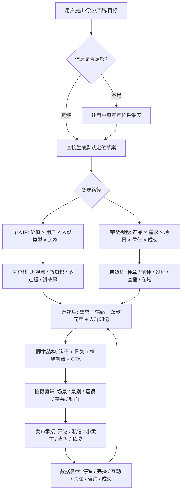
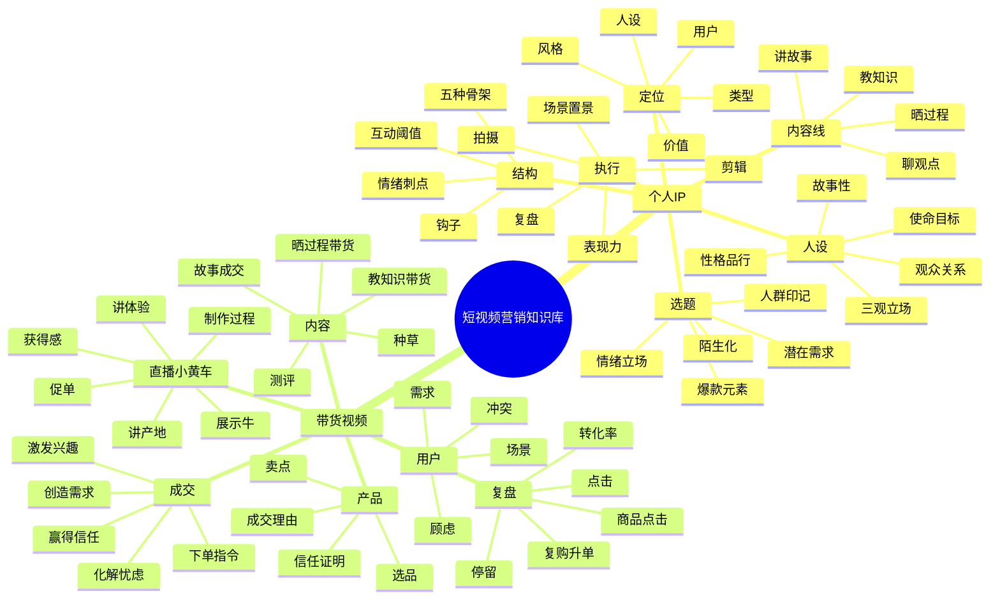

# 知识库总流程与脑图

## 总目标

以后用户给出一个行业、产品、账号、达人、实体店、服务或变现目标时，知识库不只回答概念，而是按课程方法生成：

- IP定位文档。
- 商业定位和变现路径。
- 内容栏目和选题库。
- 爆款选题与脚本。
- 拍摄、剪辑、发布执行清单。
- 直播/小黄车/私域承接方案。
- 数据复盘和下一轮优化。

## 一级分类

只按用途分两类：

- 个人IP。
- 带货视频。

课程名、文件名只保留为来源，不作为知识库分类。

## 调用流程

## 总脑图

## 默认交付包

用户只说“我要做某行业”时，默认交付：

1. 一页版IP定位。
2. 目标用户画像。
3. 账号栏目设计。
4. 30个选题。
5. 7天起号计划。
6. 3条完整脚本。
7. 拍摄和剪辑执行清单。
8. 发布与复盘表。

用户给出具体产品时，默认交付：

1. 产品需求拆解。
2. 成交理由和信任证明。
3. 带货内容矩阵。
4. 短视频脚本。
5. 直播间小黄车话术。
6. 私域/咨询承接流程。
7. 数据复盘动作。

## 输出准则

- 先判断商业目标，再做内容。
- 先判断用户情境，再写选题。
- 先确定定位，再定人设包装。
- 先做精准，再做扩散。
- 每条内容必须知道自己服务拉新、信任、转化还是复购。
- 脚本必须包含钩子、骨架、情绪刺点、CTA。
- 拍摄必须明确第一帧、场景、景别、B-roll、字幕重点。
- 复盘必须落到下一轮选题、结构、呈现或转化动作。
